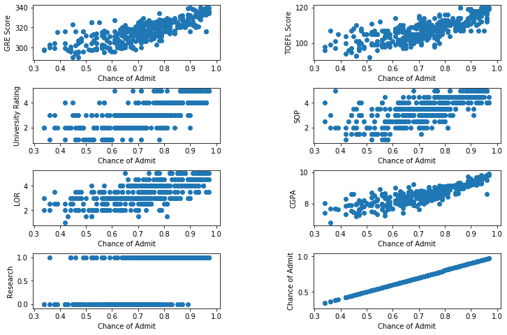
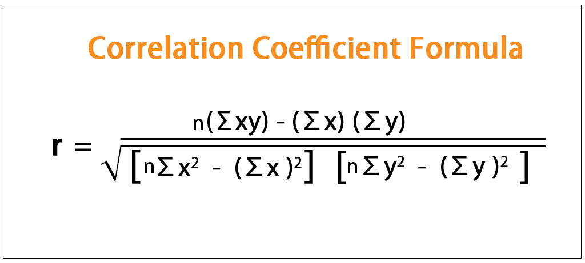
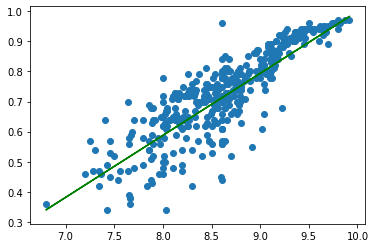

<h1 style="float: center; text-align: center;"> Navid Akbari 810895023 </h1>


```python
import pandas as pd
import math
import matplotlib.pyplot as plt
import numpy as np
```

###### Reading data from file and write them to the data


```python
data = pd.read_csv("AdmissionPredict.csv")
data
```


<div>
<style scoped>
    .dataframe tbody tr th:only-of-type {
        vertical-align: middle;
    }

    .dataframe tbody tr th {
        vertical-align: top;
    }

    .dataframe thead th {
        text-align: right;
    }
</style>
<table border="1" class="dataframe">
  <thead>
    <tr style="text-align: right;">
      <th></th>
      <th>Serial No.</th>
      <th>GRE Score</th>
      <th>TOEFL Score</th>
      <th>University Rating</th>
      <th>SOP</th>
      <th>LOR</th>
      <th>CGPA</th>
      <th>Research</th>
      <th>Chance of Admit</th>
    </tr>
  </thead>
  <tbody>
    <tr>
      <th>0</th>
      <td>1</td>
      <td>337.0</td>
      <td>118.0</td>
      <td>4</td>
      <td>4.5</td>
      <td>4.5</td>
      <td>9.65</td>
      <td>1</td>
      <td>0.92</td>
    </tr>
    <tr>
      <th>1</th>
      <td>2</td>
      <td>324.0</td>
      <td>107.0</td>
      <td>4</td>
      <td>4.0</td>
      <td>4.5</td>
      <td>8.87</td>
      <td>1</td>
      <td>NaN</td>
    </tr>
    <tr>
      <th>2</th>
      <td>3</td>
      <td>316.0</td>
      <td>NaN</td>
      <td>3</td>
      <td>3.0</td>
      <td>3.5</td>
      <td>8.00</td>
      <td>1</td>
      <td>0.72</td>
    </tr>
    <tr>
      <th>3</th>
      <td>4</td>
      <td>NaN</td>
      <td>110.0</td>
      <td>3</td>
      <td>3.5</td>
      <td>2.5</td>
      <td>8.67</td>
      <td>1</td>
      <td>0.80</td>
    </tr>
    <tr>
      <th>4</th>
      <td>5</td>
      <td>314.0</td>
      <td>103.0</td>
      <td>2</td>
      <td>2.0</td>
      <td>3.0</td>
      <td>8.21</td>
      <td>0</td>
      <td>0.65</td>
    </tr>
    <tr>
      <th>5</th>
      <td>6</td>
      <td>330.0</td>
      <td>115.0</td>
      <td>5</td>
      <td>4.5</td>
      <td>3.0</td>
      <td>9.34</td>
      <td>1</td>
      <td>0.90</td>
    </tr>
    <tr>
      <th>6</th>
      <td>7</td>
      <td>321.0</td>
      <td>109.0</td>
      <td>3</td>
      <td>3.0</td>
      <td>4.0</td>
      <td>NaN</td>
      <td>1</td>
      <td>0.75</td>
    </tr>
    <tr>
      <th>7</th>
      <td>8</td>
      <td>308.0</td>
      <td>101.0</td>
      <td>2</td>
      <td>3.0</td>
      <td>4.0</td>
      <td>7.90</td>
      <td>0</td>
      <td>0.68</td>
    </tr>
    <tr>
      <th>8</th>
      <td>9</td>
      <td>302.0</td>
      <td>102.0</td>
      <td>1</td>
      <td>2.0</td>
      <td>1.5</td>
      <td>8.00</td>
      <td>0</td>
      <td>0.50</td>
    </tr>
    <tr>
      <th>9</th>
      <td>10</td>
      <td>323.0</td>
      <td>108.0</td>
      <td>3</td>
      <td>3.5</td>
      <td>3.0</td>
      <td>8.60</td>
      <td>0</td>
      <td>0.45</td>
    </tr>
    <tr>
      <th>10</th>
      <td>11</td>
      <td>325.0</td>
      <td>106.0</td>
      <td>3</td>
      <td>3.5</td>
      <td>4.0</td>
      <td>8.40</td>
      <td>1</td>
      <td>0.52</td>
    </tr>
    <tr>
      <th>11</th>
      <td>12</td>
      <td>NaN</td>
      <td>111.0</td>
      <td>4</td>
      <td>4.0</td>
      <td>4.5</td>
      <td>9.00</td>
      <td>1</td>
      <td>0.84</td>
    </tr>
    <tr>
      <th>12</th>
      <td>13</td>
      <td>328.0</td>
      <td>112.0</td>
      <td>4</td>
      <td>4.0</td>
      <td>4.5</td>
      <td>9.10</td>
      <td>1</td>
      <td>0.78</td>
    </tr>
    <tr>
      <th>13</th>
      <td>14</td>
      <td>307.0</td>
      <td>109.0</td>
      <td>3</td>
      <td>4.0</td>
      <td>3.0</td>
      <td>8.00</td>
      <td>1</td>
      <td>0.62</td>
    </tr>
    <tr>
      <th>14</th>
      <td>15</td>
      <td>311.0</td>
      <td>104.0</td>
      <td>3</td>
      <td>3.5</td>
      <td>2.0</td>
      <td>8.20</td>
      <td>1</td>
      <td>0.61</td>
    </tr>
    <tr>
      <th>15</th>
      <td>16</td>
      <td>314.0</td>
      <td>105.0</td>
      <td>3</td>
      <td>3.5</td>
      <td>2.5</td>
      <td>8.30</td>
      <td>0</td>
      <td>0.54</td>
    </tr>
    <tr>
      <th>16</th>
      <td>17</td>
      <td>317.0</td>
      <td>107.0</td>
      <td>3</td>
      <td>4.0</td>
      <td>3.0</td>
      <td>8.70</td>
      <td>0</td>
      <td>0.66</td>
    </tr>
    <tr>
      <th>17</th>
      <td>18</td>
      <td>319.0</td>
      <td>106.0</td>
      <td>3</td>
      <td>4.0</td>
      <td>3.0</td>
      <td>8.00</td>
      <td>1</td>
      <td>0.65</td>
    </tr>
    <tr>
      <th>18</th>
      <td>19</td>
      <td>318.0</td>
      <td>110.0</td>
      <td>3</td>
      <td>4.0</td>
      <td>3.0</td>
      <td>8.80</td>
      <td>0</td>
      <td>0.63</td>
    </tr>
    <tr>
      <th>19</th>
      <td>20</td>
      <td>303.0</td>
      <td>102.0</td>
      <td>3</td>
      <td>3.5</td>
      <td>3.0</td>
      <td>8.50</td>
      <td>0</td>
      <td>0.62</td>
    </tr>
    <tr>
      <th>20</th>
      <td>21</td>
      <td>312.0</td>
      <td>107.0</td>
      <td>3</td>
      <td>3.0</td>
      <td>2.0</td>
      <td>7.90</td>
      <td>1</td>
      <td>0.64</td>
    </tr>
    <tr>
      <th>21</th>
      <td>22</td>
      <td>325.0</td>
      <td>114.0</td>
      <td>4</td>
      <td>3.0</td>
      <td>2.0</td>
      <td>8.40</td>
      <td>0</td>
      <td>0.70</td>
    </tr>
    <tr>
      <th>22</th>
      <td>23</td>
      <td>328.0</td>
      <td>116.0</td>
      <td>5</td>
      <td>5.0</td>
      <td>5.0</td>
      <td>9.50</td>
      <td>1</td>
      <td>0.94</td>
    </tr>
    <tr>
      <th>23</th>
      <td>24</td>
      <td>334.0</td>
      <td>119.0</td>
      <td>5</td>
      <td>5.0</td>
      <td>4.5</td>
      <td>9.70</td>
      <td>1</td>
      <td>0.95</td>
    </tr>
    <tr>
      <th>24</th>
      <td>25</td>
      <td>336.0</td>
      <td>119.0</td>
      <td>5</td>
      <td>4.0</td>
      <td>3.5</td>
      <td>9.80</td>
      <td>1</td>
      <td>0.97</td>
    </tr>
    <tr>
      <th>25</th>
      <td>26</td>
      <td>340.0</td>
      <td>120.0</td>
      <td>5</td>
      <td>4.5</td>
      <td>4.5</td>
      <td>9.60</td>
      <td>1</td>
      <td>0.94</td>
    </tr>
    <tr>
      <th>26</th>
      <td>27</td>
      <td>322.0</td>
      <td>109.0</td>
      <td>5</td>
      <td>4.5</td>
      <td>3.5</td>
      <td>8.80</td>
      <td>0</td>
      <td>0.76</td>
    </tr>
    <tr>
      <th>27</th>
      <td>28</td>
      <td>298.0</td>
      <td>NaN</td>
      <td>2</td>
      <td>1.5</td>
      <td>2.5</td>
      <td>NaN</td>
      <td>1</td>
      <td>0.44</td>
    </tr>
    <tr>
      <th>28</th>
      <td>29</td>
      <td>295.0</td>
      <td>93.0</td>
      <td>1</td>
      <td>2.0</td>
      <td>2.0</td>
      <td>7.20</td>
      <td>0</td>
      <td>0.46</td>
    </tr>
    <tr>
      <th>29</th>
      <td>30</td>
      <td>310.0</td>
      <td>99.0</td>
      <td>2</td>
      <td>1.5</td>
      <td>2.0</td>
      <td>7.30</td>
      <td>0</td>
      <td>0.54</td>
    </tr>
    <tr>
      <th>...</th>
      <td>...</td>
      <td>...</td>
      <td>...</td>
      <td>...</td>
      <td>...</td>
      <td>...</td>
      <td>...</td>
      <td>...</td>
      <td>...</td>
    </tr>
    <tr>
      <th>370</th>
      <td>371</td>
      <td>310.0</td>
      <td>103.0</td>
      <td>2</td>
      <td>2.5</td>
      <td>2.5</td>
      <td>8.24</td>
      <td>0</td>
      <td>0.72</td>
    </tr>
    <tr>
      <th>371</th>
      <td>372</td>
      <td>324.0</td>
      <td>110.0</td>
      <td>3</td>
      <td>3.5</td>
      <td>3.0</td>
      <td>9.22</td>
      <td>1</td>
      <td>0.89</td>
    </tr>
    <tr>
      <th>372</th>
      <td>373</td>
      <td>336.0</td>
      <td>NaN</td>
      <td>4</td>
      <td>4.5</td>
      <td>4.0</td>
      <td>9.62</td>
      <td>1</td>
      <td>0.95</td>
    </tr>
    <tr>
      <th>373</th>
      <td>374</td>
      <td>321.0</td>
      <td>109.0</td>
      <td>3</td>
      <td>3.0</td>
      <td>3.0</td>
      <td>8.54</td>
      <td>1</td>
      <td>0.79</td>
    </tr>
    <tr>
      <th>374</th>
      <td>375</td>
      <td>315.0</td>
      <td>105.0</td>
      <td>2</td>
      <td>2.0</td>
      <td>2.5</td>
      <td>7.65</td>
      <td>0</td>
      <td>0.39</td>
    </tr>
    <tr>
      <th>375</th>
      <td>376</td>
      <td>304.0</td>
      <td>101.0</td>
      <td>2</td>
      <td>2.0</td>
      <td>2.5</td>
      <td>7.66</td>
      <td>0</td>
      <td>0.38</td>
    </tr>
    <tr>
      <th>376</th>
      <td>377</td>
      <td>297.0</td>
      <td>96.0</td>
      <td>2</td>
      <td>2.5</td>
      <td>2.0</td>
      <td>7.43</td>
      <td>0</td>
      <td>0.34</td>
    </tr>
    <tr>
      <th>377</th>
      <td>378</td>
      <td>290.0</td>
      <td>100.0</td>
      <td>1</td>
      <td>1.5</td>
      <td>2.0</td>
      <td>7.56</td>
      <td>0</td>
      <td>0.47</td>
    </tr>
    <tr>
      <th>378</th>
      <td>379</td>
      <td>303.0</td>
      <td>98.0</td>
      <td>1</td>
      <td>2.0</td>
      <td>2.5</td>
      <td>7.65</td>
      <td>0</td>
      <td>0.56</td>
    </tr>
    <tr>
      <th>379</th>
      <td>380</td>
      <td>311.0</td>
      <td>99.0</td>
      <td>1</td>
      <td>2.5</td>
      <td>3.0</td>
      <td>8.43</td>
      <td>1</td>
      <td>0.71</td>
    </tr>
    <tr>
      <th>380</th>
      <td>381</td>
      <td>322.0</td>
      <td>104.0</td>
      <td>3</td>
      <td>3.5</td>
      <td>4.0</td>
      <td>8.84</td>
      <td>1</td>
      <td>0.78</td>
    </tr>
    <tr>
      <th>381</th>
      <td>382</td>
      <td>319.0</td>
      <td>105.0</td>
      <td>3</td>
      <td>3.0</td>
      <td>3.5</td>
      <td>8.67</td>
      <td>1</td>
      <td>NaN</td>
    </tr>
    <tr>
      <th>382</th>
      <td>383</td>
      <td>324.0</td>
      <td>110.0</td>
      <td>4</td>
      <td>4.5</td>
      <td>4.0</td>
      <td>9.15</td>
      <td>1</td>
      <td>0.82</td>
    </tr>
    <tr>
      <th>383</th>
      <td>384</td>
      <td>300.0</td>
      <td>100.0</td>
      <td>3</td>
      <td>3.0</td>
      <td>3.5</td>
      <td>8.26</td>
      <td>0</td>
      <td>0.62</td>
    </tr>
    <tr>
      <th>384</th>
      <td>385</td>
      <td>NaN</td>
      <td>113.0</td>
      <td>4</td>
      <td>5.0</td>
      <td>5.0</td>
      <td>9.74</td>
      <td>1</td>
      <td>0.96</td>
    </tr>
    <tr>
      <th>385</th>
      <td>386</td>
      <td>NaN</td>
      <td>117.0</td>
      <td>5</td>
      <td>5.0</td>
      <td>5.0</td>
      <td>9.82</td>
      <td>1</td>
      <td>0.96</td>
    </tr>
    <tr>
      <th>386</th>
      <td>387</td>
      <td>302.0</td>
      <td>101.0</td>
      <td>2</td>
      <td>2.5</td>
      <td>3.5</td>
      <td>7.96</td>
      <td>0</td>
      <td>0.46</td>
    </tr>
    <tr>
      <th>387</th>
      <td>388</td>
      <td>307.0</td>
      <td>105.0</td>
      <td>2</td>
      <td>2.0</td>
      <td>3.5</td>
      <td>8.10</td>
      <td>0</td>
      <td>0.53</td>
    </tr>
    <tr>
      <th>388</th>
      <td>389</td>
      <td>296.0</td>
      <td>97.0</td>
      <td>2</td>
      <td>1.5</td>
      <td>2.0</td>
      <td>7.80</td>
      <td>0</td>
      <td>0.49</td>
    </tr>
    <tr>
      <th>389</th>
      <td>390</td>
      <td>320.0</td>
      <td>108.0</td>
      <td>3</td>
      <td>3.5</td>
      <td>4.0</td>
      <td>8.44</td>
      <td>1</td>
      <td>0.76</td>
    </tr>
    <tr>
      <th>390</th>
      <td>391</td>
      <td>314.0</td>
      <td>102.0</td>
      <td>2</td>
      <td>2.0</td>
      <td>2.5</td>
      <td>8.24</td>
      <td>0</td>
      <td>NaN</td>
    </tr>
    <tr>
      <th>391</th>
      <td>392</td>
      <td>318.0</td>
      <td>106.0</td>
      <td>3</td>
      <td>2.0</td>
      <td>3.0</td>
      <td>8.65</td>
      <td>0</td>
      <td>0.71</td>
    </tr>
    <tr>
      <th>392</th>
      <td>393</td>
      <td>326.0</td>
      <td>112.0</td>
      <td>4</td>
      <td>4.0</td>
      <td>3.5</td>
      <td>NaN</td>
      <td>1</td>
      <td>0.84</td>
    </tr>
    <tr>
      <th>393</th>
      <td>394</td>
      <td>317.0</td>
      <td>104.0</td>
      <td>2</td>
      <td>3.0</td>
      <td>3.0</td>
      <td>8.76</td>
      <td>0</td>
      <td>0.77</td>
    </tr>
    <tr>
      <th>394</th>
      <td>395</td>
      <td>329.0</td>
      <td>111.0</td>
      <td>4</td>
      <td>4.5</td>
      <td>4.0</td>
      <td>9.23</td>
      <td>1</td>
      <td>0.89</td>
    </tr>
    <tr>
      <th>395</th>
      <td>396</td>
      <td>324.0</td>
      <td>110.0</td>
      <td>3</td>
      <td>3.5</td>
      <td>3.5</td>
      <td>9.04</td>
      <td>1</td>
      <td>0.82</td>
    </tr>
    <tr>
      <th>396</th>
      <td>397</td>
      <td>325.0</td>
      <td>107.0</td>
      <td>3</td>
      <td>3.0</td>
      <td>3.5</td>
      <td>9.11</td>
      <td>1</td>
      <td>NaN</td>
    </tr>
    <tr>
      <th>397</th>
      <td>398</td>
      <td>330.0</td>
      <td>116.0</td>
      <td>4</td>
      <td>5.0</td>
      <td>4.5</td>
      <td>9.45</td>
      <td>1</td>
      <td>0.91</td>
    </tr>
    <tr>
      <th>398</th>
      <td>399</td>
      <td>312.0</td>
      <td>103.0</td>
      <td>3</td>
      <td>3.5</td>
      <td>4.0</td>
      <td>8.78</td>
      <td>0</td>
      <td>0.67</td>
    </tr>
    <tr>
      <th>399</th>
      <td>400</td>
      <td>333.0</td>
      <td>117.0</td>
      <td>4</td>
      <td>5.0</td>
      <td>4.0</td>
      <td>9.66</td>
      <td>1</td>
      <td>0.95</td>
    </tr>
  </tbody>
</table>
<p>400 rows × 9 columns</p>
</div>


###### Showing the first 5 data of dataset


```python
data.head()
```


<div>
<style scoped>
    .dataframe tbody tr th:only-of-type {
        vertical-align: middle;
    }

    .dataframe tbody tr th {
        vertical-align: top;
    }

    .dataframe thead th {
        text-align: right;
    }
</style>
<table border="1" class="dataframe">
  <thead>
    <tr style="text-align: right;">
      <th></th>
      <th>Serial No.</th>
      <th>GRE Score</th>
      <th>TOEFL Score</th>
      <th>University Rating</th>
      <th>SOP</th>
      <th>LOR</th>
      <th>CGPA</th>
      <th>Research</th>
      <th>Chance of Admit</th>
    </tr>
  </thead>
  <tbody>
    <tr>
      <th>0</th>
      <td>1</td>
      <td>337.0</td>
      <td>118.0</td>
      <td>4</td>
      <td>4.5</td>
      <td>4.5</td>
      <td>9.65</td>
      <td>1</td>
      <td>0.92</td>
    </tr>
    <tr>
      <th>1</th>
      <td>2</td>
      <td>324.0</td>
      <td>107.0</td>
      <td>4</td>
      <td>4.0</td>
      <td>4.5</td>
      <td>8.87</td>
      <td>1</td>
      <td>NaN</td>
    </tr>
    <tr>
      <th>2</th>
      <td>3</td>
      <td>316.0</td>
      <td>NaN</td>
      <td>3</td>
      <td>3.0</td>
      <td>3.5</td>
      <td>8.00</td>
      <td>1</td>
      <td>0.72</td>
    </tr>
    <tr>
      <th>3</th>
      <td>4</td>
      <td>NaN</td>
      <td>110.0</td>
      <td>3</td>
      <td>3.5</td>
      <td>2.5</td>
      <td>8.67</td>
      <td>1</td>
      <td>0.80</td>
    </tr>
    <tr>
      <th>4</th>
      <td>5</td>
      <td>314.0</td>
      <td>103.0</td>
      <td>2</td>
      <td>2.0</td>
      <td>3.0</td>
      <td>8.21</td>
      <td>0</td>
      <td>0.65</td>
    </tr>
  </tbody>
</table>
</div>


```python
data.describe()
```


<div>
<style scoped>
    .dataframe tbody tr th:only-of-type {
        vertical-align: middle;
    }

    .dataframe tbody tr th {
        vertical-align: top;
    }

    .dataframe thead th {
        text-align: right;
    }
</style>
<table border="1" class="dataframe">
  <thead>
    <tr style="text-align: right;">
      <th></th>
      <th>Serial No.</th>
      <th>GRE Score</th>
      <th>TOEFL Score</th>
      <th>University Rating</th>
      <th>SOP</th>
      <th>LOR</th>
      <th>CGPA</th>
      <th>Research</th>
      <th>Chance of Admit</th>
    </tr>
  </thead>
  <tbody>
    <tr>
      <th>count</th>
      <td>400.000000</td>
      <td>378.000000</td>
      <td>380.000000</td>
      <td>400.000000</td>
      <td>400.000000</td>
      <td>400.000000</td>
      <td>380.000000</td>
      <td>400.000000</td>
      <td>384.000000</td>
    </tr>
    <tr>
      <th>mean</th>
      <td>200.500000</td>
      <td>316.759259</td>
      <td>107.386842</td>
      <td>3.087500</td>
      <td>3.400000</td>
      <td>3.452500</td>
      <td>8.604737</td>
      <td>0.547500</td>
      <td>0.724375</td>
    </tr>
    <tr>
      <th>std</th>
      <td>115.614301</td>
      <td>11.415599</td>
      <td>6.048645</td>
      <td>1.143728</td>
      <td>1.006869</td>
      <td>0.898478</td>
      <td>0.599167</td>
      <td>0.498362</td>
      <td>0.142964</td>
    </tr>
    <tr>
      <th>min</th>
      <td>1.000000</td>
      <td>290.000000</td>
      <td>92.000000</td>
      <td>1.000000</td>
      <td>1.000000</td>
      <td>1.000000</td>
      <td>6.800000</td>
      <td>0.000000</td>
      <td>0.340000</td>
    </tr>
    <tr>
      <th>25%</th>
      <td>100.750000</td>
      <td>308.250000</td>
      <td>103.000000</td>
      <td>2.000000</td>
      <td>2.500000</td>
      <td>3.000000</td>
      <td>8.170000</td>
      <td>0.000000</td>
      <td>0.640000</td>
    </tr>
    <tr>
      <th>50%</th>
      <td>200.500000</td>
      <td>317.000000</td>
      <td>107.000000</td>
      <td>3.000000</td>
      <td>3.500000</td>
      <td>3.500000</td>
      <td>8.640000</td>
      <td>1.000000</td>
      <td>0.730000</td>
    </tr>
    <tr>
      <th>75%</th>
      <td>300.250000</td>
      <td>325.000000</td>
      <td>112.000000</td>
      <td>4.000000</td>
      <td>4.000000</td>
      <td>4.000000</td>
      <td>9.080000</td>
      <td>1.000000</td>
      <td>0.830000</td>
    </tr>
    <tr>
      <th>max</th>
      <td>400.000000</td>
      <td>340.000000</td>
      <td>120.000000</td>
      <td>5.000000</td>
      <td>5.000000</td>
      <td>5.000000</td>
      <td>9.920000</td>
      <td>1.000000</td>
      <td>0.970000</td>
    </tr>
  </tbody>
</table>
</div>


```python
data.info()
```

    <class 'pandas.core.frame.DataFrame'>
    RangeIndex: 400 entries, 0 to 399
    Data columns (total 9 columns):
    Serial No.           400 non-null int64
    GRE Score            378 non-null float64
    TOEFL Score          380 non-null float64
    University Rating    400 non-null int64
    SOP                  400 non-null float64
    LOR                  400 non-null float64
    CGPA                 380 non-null float64
    Research             400 non-null int64
    Chance of Admit      384 non-null float64
    dtypes: float64(6), int64(3)
    memory usage: 28.2 KB


###### Counting number of NaN data in each column of the dataset


```python
data.isnull().sum()
```


    Serial No.            0
    GRE Score            22
    TOEFL Score          20
    University Rating     0
    SOP                   0
    LOR                   0
    CGPA                 20
    Research              0
    Chance of Admit      16
    dtype: int64


##### choosing which column should check for substitution of the NaN values with the mean of that column


```python
values = {'GRE Score': int(data['GRE Score'].mean()), 'TOEFL Score': int(data['TOEFL Score'].mean()), 'CGPA': data['CGPA'].mean()}
values
```


    {'GRE Score': 316, 'TOEFL Score': 107, 'CGPA': 8.604736842105263}


##### substitution of NaN value with the mean of that column


```python
data = data.fillna(value=values)
data
```


<div>
<style scoped>
    .dataframe tbody tr th:only-of-type {
        vertical-align: middle;
    }

    .dataframe tbody tr th {
        vertical-align: top;
    }

    .dataframe thead th {
        text-align: right;
    }
</style>
<table border="1" class="dataframe">
  <thead>
    <tr style="text-align: right;">
      <th></th>
      <th>Serial No.</th>
      <th>GRE Score</th>
      <th>TOEFL Score</th>
      <th>University Rating</th>
      <th>SOP</th>
      <th>LOR</th>
      <th>CGPA</th>
      <th>Research</th>
      <th>Chance of Admit</th>
    </tr>
  </thead>
  <tbody>
    <tr>
      <th>0</th>
      <td>1</td>
      <td>337.0</td>
      <td>118.0</td>
      <td>4</td>
      <td>4.5</td>
      <td>4.5</td>
      <td>9.650000</td>
      <td>1</td>
      <td>0.92</td>
    </tr>
    <tr>
      <th>1</th>
      <td>2</td>
      <td>324.0</td>
      <td>107.0</td>
      <td>4</td>
      <td>4.0</td>
      <td>4.5</td>
      <td>8.870000</td>
      <td>1</td>
      <td>NaN</td>
    </tr>
    <tr>
      <th>2</th>
      <td>3</td>
      <td>316.0</td>
      <td>107.0</td>
      <td>3</td>
      <td>3.0</td>
      <td>3.5</td>
      <td>8.000000</td>
      <td>1</td>
      <td>0.72</td>
    </tr>
    <tr>
      <th>3</th>
      <td>4</td>
      <td>316.0</td>
      <td>110.0</td>
      <td>3</td>
      <td>3.5</td>
      <td>2.5</td>
      <td>8.670000</td>
      <td>1</td>
      <td>0.80</td>
    </tr>
    <tr>
      <th>4</th>
      <td>5</td>
      <td>314.0</td>
      <td>103.0</td>
      <td>2</td>
      <td>2.0</td>
      <td>3.0</td>
      <td>8.210000</td>
      <td>0</td>
      <td>0.65</td>
    </tr>
    <tr>
      <th>5</th>
      <td>6</td>
      <td>330.0</td>
      <td>115.0</td>
      <td>5</td>
      <td>4.5</td>
      <td>3.0</td>
      <td>9.340000</td>
      <td>1</td>
      <td>0.90</td>
    </tr>
    <tr>
      <th>6</th>
      <td>7</td>
      <td>321.0</td>
      <td>109.0</td>
      <td>3</td>
      <td>3.0</td>
      <td>4.0</td>
      <td>8.604737</td>
      <td>1</td>
      <td>0.75</td>
    </tr>
    <tr>
      <th>7</th>
      <td>8</td>
      <td>308.0</td>
      <td>101.0</td>
      <td>2</td>
      <td>3.0</td>
      <td>4.0</td>
      <td>7.900000</td>
      <td>0</td>
      <td>0.68</td>
    </tr>
    <tr>
      <th>8</th>
      <td>9</td>
      <td>302.0</td>
      <td>102.0</td>
      <td>1</td>
      <td>2.0</td>
      <td>1.5</td>
      <td>8.000000</td>
      <td>0</td>
      <td>0.50</td>
    </tr>
    <tr>
      <th>9</th>
      <td>10</td>
      <td>323.0</td>
      <td>108.0</td>
      <td>3</td>
      <td>3.5</td>
      <td>3.0</td>
      <td>8.600000</td>
      <td>0</td>
      <td>0.45</td>
    </tr>
    <tr>
      <th>10</th>
      <td>11</td>
      <td>325.0</td>
      <td>106.0</td>
      <td>3</td>
      <td>3.5</td>
      <td>4.0</td>
      <td>8.400000</td>
      <td>1</td>
      <td>0.52</td>
    </tr>
    <tr>
      <th>11</th>
      <td>12</td>
      <td>316.0</td>
      <td>111.0</td>
      <td>4</td>
      <td>4.0</td>
      <td>4.5</td>
      <td>9.000000</td>
      <td>1</td>
      <td>0.84</td>
    </tr>
    <tr>
      <th>12</th>
      <td>13</td>
      <td>328.0</td>
      <td>112.0</td>
      <td>4</td>
      <td>4.0</td>
      <td>4.5</td>
      <td>9.100000</td>
      <td>1</td>
      <td>0.78</td>
    </tr>
    <tr>
      <th>13</th>
      <td>14</td>
      <td>307.0</td>
      <td>109.0</td>
      <td>3</td>
      <td>4.0</td>
      <td>3.0</td>
      <td>8.000000</td>
      <td>1</td>
      <td>0.62</td>
    </tr>
    <tr>
      <th>14</th>
      <td>15</td>
      <td>311.0</td>
      <td>104.0</td>
      <td>3</td>
      <td>3.5</td>
      <td>2.0</td>
      <td>8.200000</td>
      <td>1</td>
      <td>0.61</td>
    </tr>
    <tr>
      <th>15</th>
      <td>16</td>
      <td>314.0</td>
      <td>105.0</td>
      <td>3</td>
      <td>3.5</td>
      <td>2.5</td>
      <td>8.300000</td>
      <td>0</td>
      <td>0.54</td>
    </tr>
    <tr>
      <th>16</th>
      <td>17</td>
      <td>317.0</td>
      <td>107.0</td>
      <td>3</td>
      <td>4.0</td>
      <td>3.0</td>
      <td>8.700000</td>
      <td>0</td>
      <td>0.66</td>
    </tr>
    <tr>
      <th>17</th>
      <td>18</td>
      <td>319.0</td>
      <td>106.0</td>
      <td>3</td>
      <td>4.0</td>
      <td>3.0</td>
      <td>8.000000</td>
      <td>1</td>
      <td>0.65</td>
    </tr>
    <tr>
      <th>18</th>
      <td>19</td>
      <td>318.0</td>
      <td>110.0</td>
      <td>3</td>
      <td>4.0</td>
      <td>3.0</td>
      <td>8.800000</td>
      <td>0</td>
      <td>0.63</td>
    </tr>
    <tr>
      <th>19</th>
      <td>20</td>
      <td>303.0</td>
      <td>102.0</td>
      <td>3</td>
      <td>3.5</td>
      <td>3.0</td>
      <td>8.500000</td>
      <td>0</td>
      <td>0.62</td>
    </tr>
    <tr>
      <th>20</th>
      <td>21</td>
      <td>312.0</td>
      <td>107.0</td>
      <td>3</td>
      <td>3.0</td>
      <td>2.0</td>
      <td>7.900000</td>
      <td>1</td>
      <td>0.64</td>
    </tr>
    <tr>
      <th>21</th>
      <td>22</td>
      <td>325.0</td>
      <td>114.0</td>
      <td>4</td>
      <td>3.0</td>
      <td>2.0</td>
      <td>8.400000</td>
      <td>0</td>
      <td>0.70</td>
    </tr>
    <tr>
      <th>22</th>
      <td>23</td>
      <td>328.0</td>
      <td>116.0</td>
      <td>5</td>
      <td>5.0</td>
      <td>5.0</td>
      <td>9.500000</td>
      <td>1</td>
      <td>0.94</td>
    </tr>
    <tr>
      <th>23</th>
      <td>24</td>
      <td>334.0</td>
      <td>119.0</td>
      <td>5</td>
      <td>5.0</td>
      <td>4.5</td>
      <td>9.700000</td>
      <td>1</td>
      <td>0.95</td>
    </tr>
    <tr>
      <th>24</th>
      <td>25</td>
      <td>336.0</td>
      <td>119.0</td>
      <td>5</td>
      <td>4.0</td>
      <td>3.5</td>
      <td>9.800000</td>
      <td>1</td>
      <td>0.97</td>
    </tr>
    <tr>
      <th>25</th>
      <td>26</td>
      <td>340.0</td>
      <td>120.0</td>
      <td>5</td>
      <td>4.5</td>
      <td>4.5</td>
      <td>9.600000</td>
      <td>1</td>
      <td>0.94</td>
    </tr>
    <tr>
      <th>26</th>
      <td>27</td>
      <td>322.0</td>
      <td>109.0</td>
      <td>5</td>
      <td>4.5</td>
      <td>3.5</td>
      <td>8.800000</td>
      <td>0</td>
      <td>0.76</td>
    </tr>
    <tr>
      <th>27</th>
      <td>28</td>
      <td>298.0</td>
      <td>107.0</td>
      <td>2</td>
      <td>1.5</td>
      <td>2.5</td>
      <td>8.604737</td>
      <td>1</td>
      <td>0.44</td>
    </tr>
    <tr>
      <th>28</th>
      <td>29</td>
      <td>295.0</td>
      <td>93.0</td>
      <td>1</td>
      <td>2.0</td>
      <td>2.0</td>
      <td>7.200000</td>
      <td>0</td>
      <td>0.46</td>
    </tr>
    <tr>
      <th>29</th>
      <td>30</td>
      <td>310.0</td>
      <td>99.0</td>
      <td>2</td>
      <td>1.5</td>
      <td>2.0</td>
      <td>7.300000</td>
      <td>0</td>
      <td>0.54</td>
    </tr>
    <tr>
      <th>...</th>
      <td>...</td>
      <td>...</td>
      <td>...</td>
      <td>...</td>
      <td>...</td>
      <td>...</td>
      <td>...</td>
      <td>...</td>
      <td>...</td>
    </tr>
    <tr>
      <th>370</th>
      <td>371</td>
      <td>310.0</td>
      <td>103.0</td>
      <td>2</td>
      <td>2.5</td>
      <td>2.5</td>
      <td>8.240000</td>
      <td>0</td>
      <td>0.72</td>
    </tr>
    <tr>
      <th>371</th>
      <td>372</td>
      <td>324.0</td>
      <td>110.0</td>
      <td>3</td>
      <td>3.5</td>
      <td>3.0</td>
      <td>9.220000</td>
      <td>1</td>
      <td>0.89</td>
    </tr>
    <tr>
      <th>372</th>
      <td>373</td>
      <td>336.0</td>
      <td>107.0</td>
      <td>4</td>
      <td>4.5</td>
      <td>4.0</td>
      <td>9.620000</td>
      <td>1</td>
      <td>0.95</td>
    </tr>
    <tr>
      <th>373</th>
      <td>374</td>
      <td>321.0</td>
      <td>109.0</td>
      <td>3</td>
      <td>3.0</td>
      <td>3.0</td>
      <td>8.540000</td>
      <td>1</td>
      <td>0.79</td>
    </tr>
    <tr>
      <th>374</th>
      <td>375</td>
      <td>315.0</td>
      <td>105.0</td>
      <td>2</td>
      <td>2.0</td>
      <td>2.5</td>
      <td>7.650000</td>
      <td>0</td>
      <td>0.39</td>
    </tr>
    <tr>
      <th>375</th>
      <td>376</td>
      <td>304.0</td>
      <td>101.0</td>
      <td>2</td>
      <td>2.0</td>
      <td>2.5</td>
      <td>7.660000</td>
      <td>0</td>
      <td>0.38</td>
    </tr>
    <tr>
      <th>376</th>
      <td>377</td>
      <td>297.0</td>
      <td>96.0</td>
      <td>2</td>
      <td>2.5</td>
      <td>2.0</td>
      <td>7.430000</td>
      <td>0</td>
      <td>0.34</td>
    </tr>
    <tr>
      <th>377</th>
      <td>378</td>
      <td>290.0</td>
      <td>100.0</td>
      <td>1</td>
      <td>1.5</td>
      <td>2.0</td>
      <td>7.560000</td>
      <td>0</td>
      <td>0.47</td>
    </tr>
    <tr>
      <th>378</th>
      <td>379</td>
      <td>303.0</td>
      <td>98.0</td>
      <td>1</td>
      <td>2.0</td>
      <td>2.5</td>
      <td>7.650000</td>
      <td>0</td>
      <td>0.56</td>
    </tr>
    <tr>
      <th>379</th>
      <td>380</td>
      <td>311.0</td>
      <td>99.0</td>
      <td>1</td>
      <td>2.5</td>
      <td>3.0</td>
      <td>8.430000</td>
      <td>1</td>
      <td>0.71</td>
    </tr>
    <tr>
      <th>380</th>
      <td>381</td>
      <td>322.0</td>
      <td>104.0</td>
      <td>3</td>
      <td>3.5</td>
      <td>4.0</td>
      <td>8.840000</td>
      <td>1</td>
      <td>0.78</td>
    </tr>
    <tr>
      <th>381</th>
      <td>382</td>
      <td>319.0</td>
      <td>105.0</td>
      <td>3</td>
      <td>3.0</td>
      <td>3.5</td>
      <td>8.670000</td>
      <td>1</td>
      <td>NaN</td>
    </tr>
    <tr>
      <th>382</th>
      <td>383</td>
      <td>324.0</td>
      <td>110.0</td>
      <td>4</td>
      <td>4.5</td>
      <td>4.0</td>
      <td>9.150000</td>
      <td>1</td>
      <td>0.82</td>
    </tr>
    <tr>
      <th>383</th>
      <td>384</td>
      <td>300.0</td>
      <td>100.0</td>
      <td>3</td>
      <td>3.0</td>
      <td>3.5</td>
      <td>8.260000</td>
      <td>0</td>
      <td>0.62</td>
    </tr>
    <tr>
      <th>384</th>
      <td>385</td>
      <td>316.0</td>
      <td>113.0</td>
      <td>4</td>
      <td>5.0</td>
      <td>5.0</td>
      <td>9.740000</td>
      <td>1</td>
      <td>0.96</td>
    </tr>
    <tr>
      <th>385</th>
      <td>386</td>
      <td>316.0</td>
      <td>117.0</td>
      <td>5</td>
      <td>5.0</td>
      <td>5.0</td>
      <td>9.820000</td>
      <td>1</td>
      <td>0.96</td>
    </tr>
    <tr>
      <th>386</th>
      <td>387</td>
      <td>302.0</td>
      <td>101.0</td>
      <td>2</td>
      <td>2.5</td>
      <td>3.5</td>
      <td>7.960000</td>
      <td>0</td>
      <td>0.46</td>
    </tr>
    <tr>
      <th>387</th>
      <td>388</td>
      <td>307.0</td>
      <td>105.0</td>
      <td>2</td>
      <td>2.0</td>
      <td>3.5</td>
      <td>8.100000</td>
      <td>0</td>
      <td>0.53</td>
    </tr>
    <tr>
      <th>388</th>
      <td>389</td>
      <td>296.0</td>
      <td>97.0</td>
      <td>2</td>
      <td>1.5</td>
      <td>2.0</td>
      <td>7.800000</td>
      <td>0</td>
      <td>0.49</td>
    </tr>
    <tr>
      <th>389</th>
      <td>390</td>
      <td>320.0</td>
      <td>108.0</td>
      <td>3</td>
      <td>3.5</td>
      <td>4.0</td>
      <td>8.440000</td>
      <td>1</td>
      <td>0.76</td>
    </tr>
    <tr>
      <th>390</th>
      <td>391</td>
      <td>314.0</td>
      <td>102.0</td>
      <td>2</td>
      <td>2.0</td>
      <td>2.5</td>
      <td>8.240000</td>
      <td>0</td>
      <td>NaN</td>
    </tr>
    <tr>
      <th>391</th>
      <td>392</td>
      <td>318.0</td>
      <td>106.0</td>
      <td>3</td>
      <td>2.0</td>
      <td>3.0</td>
      <td>8.650000</td>
      <td>0</td>
      <td>0.71</td>
    </tr>
    <tr>
      <th>392</th>
      <td>393</td>
      <td>326.0</td>
      <td>112.0</td>
      <td>4</td>
      <td>4.0</td>
      <td>3.5</td>
      <td>8.604737</td>
      <td>1</td>
      <td>0.84</td>
    </tr>
    <tr>
      <th>393</th>
      <td>394</td>
      <td>317.0</td>
      <td>104.0</td>
      <td>2</td>
      <td>3.0</td>
      <td>3.0</td>
      <td>8.760000</td>
      <td>0</td>
      <td>0.77</td>
    </tr>
    <tr>
      <th>394</th>
      <td>395</td>
      <td>329.0</td>
      <td>111.0</td>
      <td>4</td>
      <td>4.5</td>
      <td>4.0</td>
      <td>9.230000</td>
      <td>1</td>
      <td>0.89</td>
    </tr>
    <tr>
      <th>395</th>
      <td>396</td>
      <td>324.0</td>
      <td>110.0</td>
      <td>3</td>
      <td>3.5</td>
      <td>3.5</td>
      <td>9.040000</td>
      <td>1</td>
      <td>0.82</td>
    </tr>
    <tr>
      <th>396</th>
      <td>397</td>
      <td>325.0</td>
      <td>107.0</td>
      <td>3</td>
      <td>3.0</td>
      <td>3.5</td>
      <td>9.110000</td>
      <td>1</td>
      <td>NaN</td>
    </tr>
    <tr>
      <th>397</th>
      <td>398</td>
      <td>330.0</td>
      <td>116.0</td>
      <td>4</td>
      <td>5.0</td>
      <td>4.5</td>
      <td>9.450000</td>
      <td>1</td>
      <td>0.91</td>
    </tr>
    <tr>
      <th>398</th>
      <td>399</td>
      <td>312.0</td>
      <td>103.0</td>
      <td>3</td>
      <td>3.5</td>
      <td>4.0</td>
      <td>8.780000</td>
      <td>0</td>
      <td>0.67</td>
    </tr>
    <tr>
      <th>399</th>
      <td>400</td>
      <td>333.0</td>
      <td>117.0</td>
      <td>4</td>
      <td>5.0</td>
      <td>4.0</td>
      <td>9.660000</td>
      <td>1</td>
      <td>0.95</td>
    </tr>
  </tbody>
</table>
<p>400 rows × 9 columns</p>
</div>


##### Checking that the code is runnig well


```python
data.isnull().sum()
```


    Serial No.            0
    GRE Score             0
    TOEFL Score           0
    University Rating     0
    SOP                   0
    LOR                   0
    CGPA                  0
    Research              0
    Chance of Admit      16
    dtype: int64


##### Drawing plots of Chance of Admit based on different columns of the dataset using matplotlib and subplot


```python
colors = (0,0,0)
area = np.pi*3
plt.subplots_adjust(hspace=0.5, wspace=0.5)
plt.gcf().set_size_inches(plt.gcf().get_size_inches()[0]*2, plt.gcf().get_size_inches()[1]*2, forward=True)
# Plot
plt.subplot(4, 2, 1)
plt.scatter(data['Chance of Admit'], data['GRE Score'])
plt.xlabel('Chance of Admit')
plt.ylabel('GRE Score')

plt.subplot(4, 2, 2)
plt.scatter(data['Chance of Admit'], data['TOEFL Score'])
plt.xlabel('Chance of Admit')
plt.ylabel('TOEFL Score')

plt.subplot(4, 2, 3)
plt.scatter(data['Chance of Admit'], data['University Rating'])
plt.xlabel('Chance of Admit')
plt.ylabel('University Rating')

plt.subplot(4, 2, 4)
plt.scatter(data['Chance of Admit'], data['SOP'])
plt.xlabel('Chance of Admit')
plt.ylabel('SOP')

plt.subplot(4, 2, 5)
plt.scatter(data['Chance of Admit'], data['LOR '])
plt.xlabel('Chance of Admit')
plt.ylabel('LOR')

plt.subplot(4, 2, 6)
plt.scatter(data['Chance of Admit'], data['CGPA'])
plt.xlabel('Chance of Admit')
plt.ylabel('CGPA')

plt.subplot(4, 2, 7)
plt.scatter(data['Chance of Admit'], data['Research'])
plt.xlabel('Chance of Admit')
plt.ylabel('Research')

plt.subplot(4, 2, 8)
plt.scatter(data['Chance of Admit'], data['Chance of Admit'])
plt.xlabel('Chance of Admit')
plt.ylabel('Chance of Admit')


plt.show()
```





#### For finding the column that has the most correlation with Chance of Admit column, I use corr() function, which calculates the correlation of two different data. After the calculation of the correlation, we can see from the result that the __CGPA__ metric has the most correlation with Chance of Admit. 

<div>

</div>

#### As shown in above, correlation formula coefficient calculated using the above formula. 


#### The meaning of different results in correlation coefficient are:
* A correlation coefficient of 1 means that for every positive increase in one variable, there is a positive increase of a fixed proportion in the other. For example, shoe sizes go up in (almost) perfect correlation with foot length.

* A correlation coefficient of -1 means that for every positive increase in one variable, there is a negative decrease of a fixed proportion in the other. For example, the amount of gas in a tank decreases in (almost) perfect correlation with speed.

* Zero means that for every increase, there isn’t a positive or negative increase. The two just aren’t related.

#### So we should find the most positive number in our results. Hence, __CGPA__ with 0.85 correlation coefficient is the best metric.


```python
data.corr()
```


<div>
<style scoped>
    .dataframe tbody tr th:only-of-type {
        vertical-align: middle;
    }

    .dataframe tbody tr th {
        vertical-align: top;
    }

    .dataframe thead th {
        text-align: right;
    }
</style>
<table border="1" class="dataframe">
  <thead>
    <tr style="text-align: right;">
      <th></th>
      <th>Serial No.</th>
      <th>GRE Score</th>
      <th>TOEFL Score</th>
      <th>University Rating</th>
      <th>SOP</th>
      <th>LOR</th>
      <th>CGPA</th>
      <th>Research</th>
      <th>Chance of Admit</th>
    </tr>
  </thead>
  <tbody>
    <tr>
      <th>Serial No.</th>
      <td>1.000000</td>
      <td>-0.102429</td>
      <td>-0.157229</td>
      <td>-0.169948</td>
      <td>-0.166932</td>
      <td>-0.088221</td>
      <td>-0.062254</td>
      <td>-0.063138</td>
      <td>0.047057</td>
    </tr>
    <tr>
      <th>GRE Score</th>
      <td>-0.102429</td>
      <td>1.000000</td>
      <td>0.804004</td>
      <td>0.659280</td>
      <td>0.599359</td>
      <td>0.543458</td>
      <td>0.794262</td>
      <td>0.571368</td>
      <td>0.784770</td>
    </tr>
    <tr>
      <th>TOEFL Score</th>
      <td>-0.157229</td>
      <td>0.804004</td>
      <td>1.000000</td>
      <td>0.681340</td>
      <td>0.633807</td>
      <td>0.555214</td>
      <td>0.799132</td>
      <td>0.498590</td>
      <td>0.758711</td>
    </tr>
    <tr>
      <th>University Rating</th>
      <td>-0.169948</td>
      <td>0.659280</td>
      <td>0.681340</td>
      <td>1.000000</td>
      <td>0.734523</td>
      <td>0.660123</td>
      <td>0.733424</td>
      <td>0.447783</td>
      <td>0.707191</td>
    </tr>
    <tr>
      <th>SOP</th>
      <td>-0.166932</td>
      <td>0.599359</td>
      <td>0.633807</td>
      <td>0.734523</td>
      <td>1.000000</td>
      <td>0.729593</td>
      <td>0.695528</td>
      <td>0.444029</td>
      <td>0.680752</td>
    </tr>
    <tr>
      <th>LOR</th>
      <td>-0.088221</td>
      <td>0.543458</td>
      <td>0.555214</td>
      <td>0.660123</td>
      <td>0.729593</td>
      <td>1.000000</td>
      <td>0.660742</td>
      <td>0.396859</td>
      <td>0.663452</td>
    </tr>
    <tr>
      <th>CGPA</th>
      <td>-0.062254</td>
      <td>0.794262</td>
      <td>0.799132</td>
      <td>0.733424</td>
      <td>0.695528</td>
      <td>0.660742</td>
      <td>1.000000</td>
      <td>0.514092</td>
      <td>0.855675</td>
    </tr>
    <tr>
      <th>Research</th>
      <td>-0.063138</td>
      <td>0.571368</td>
      <td>0.498590</td>
      <td>0.447783</td>
      <td>0.444029</td>
      <td>0.396859</td>
      <td>0.514092</td>
      <td>1.000000</td>
      <td>0.548443</td>
    </tr>
    <tr>
      <th>Chance of Admit</th>
      <td>0.047057</td>
      <td>0.784770</td>
      <td>0.758711</td>
      <td>0.707191</td>
      <td>0.680752</td>
      <td>0.663452</td>
      <td>0.855675</td>
      <td>0.548443</td>
      <td>1.000000</td>
    </tr>
  </tbody>
</table>
</div>


##### Finding students that their minimum CGPA and TOEFL scores are 9 and 110, respectively.


```python
filtered_student = data[(data['CGPA'] >= 9) & (data['TOEFL Score'] >= 110)];
filtered_student
```


<div>
<style scoped>
    .dataframe tbody tr th:only-of-type {
        vertical-align: middle;
    }

    .dataframe tbody tr th {
        vertical-align: top;
    }

    .dataframe thead th {
        text-align: right;
    }
</style>
<table border="1" class="dataframe">
  <thead>
    <tr style="text-align: right;">
      <th></th>
      <th>Serial No.</th>
      <th>GRE Score</th>
      <th>TOEFL Score</th>
      <th>University Rating</th>
      <th>SOP</th>
      <th>LOR</th>
      <th>CGPA</th>
      <th>Research</th>
      <th>Chance of Admit</th>
    </tr>
  </thead>
  <tbody>
    <tr>
      <th>0</th>
      <td>1</td>
      <td>337.0</td>
      <td>118.0</td>
      <td>4</td>
      <td>4.5</td>
      <td>4.5</td>
      <td>9.65</td>
      <td>1</td>
      <td>0.92</td>
    </tr>
    <tr>
      <th>5</th>
      <td>6</td>
      <td>330.0</td>
      <td>115.0</td>
      <td>5</td>
      <td>4.5</td>
      <td>3.0</td>
      <td>9.34</td>
      <td>1</td>
      <td>0.90</td>
    </tr>
    <tr>
      <th>11</th>
      <td>12</td>
      <td>316.0</td>
      <td>111.0</td>
      <td>4</td>
      <td>4.0</td>
      <td>4.5</td>
      <td>9.00</td>
      <td>1</td>
      <td>0.84</td>
    </tr>
    <tr>
      <th>12</th>
      <td>13</td>
      <td>328.0</td>
      <td>112.0</td>
      <td>4</td>
      <td>4.0</td>
      <td>4.5</td>
      <td>9.10</td>
      <td>1</td>
      <td>0.78</td>
    </tr>
    <tr>
      <th>22</th>
      <td>23</td>
      <td>328.0</td>
      <td>116.0</td>
      <td>5</td>
      <td>5.0</td>
      <td>5.0</td>
      <td>9.50</td>
      <td>1</td>
      <td>0.94</td>
    </tr>
    <tr>
      <th>23</th>
      <td>24</td>
      <td>334.0</td>
      <td>119.0</td>
      <td>5</td>
      <td>5.0</td>
      <td>4.5</td>
      <td>9.70</td>
      <td>1</td>
      <td>0.95</td>
    </tr>
    <tr>
      <th>24</th>
      <td>25</td>
      <td>336.0</td>
      <td>119.0</td>
      <td>5</td>
      <td>4.0</td>
      <td>3.5</td>
      <td>9.80</td>
      <td>1</td>
      <td>0.97</td>
    </tr>
    <tr>
      <th>25</th>
      <td>26</td>
      <td>340.0</td>
      <td>120.0</td>
      <td>5</td>
      <td>4.5</td>
      <td>4.5</td>
      <td>9.60</td>
      <td>1</td>
      <td>0.94</td>
    </tr>
    <tr>
      <th>32</th>
      <td>33</td>
      <td>338.0</td>
      <td>118.0</td>
      <td>4</td>
      <td>3.0</td>
      <td>4.5</td>
      <td>9.40</td>
      <td>1</td>
      <td>0.91</td>
    </tr>
    <tr>
      <th>33</th>
      <td>34</td>
      <td>340.0</td>
      <td>114.0</td>
      <td>5</td>
      <td>4.0</td>
      <td>4.0</td>
      <td>9.60</td>
      <td>1</td>
      <td>0.90</td>
    </tr>
    <tr>
      <th>34</th>
      <td>35</td>
      <td>331.0</td>
      <td>112.0</td>
      <td>5</td>
      <td>4.0</td>
      <td>5.0</td>
      <td>9.80</td>
      <td>1</td>
      <td>0.94</td>
    </tr>
    <tr>
      <th>35</th>
      <td>36</td>
      <td>320.0</td>
      <td>110.0</td>
      <td>5</td>
      <td>5.0</td>
      <td>5.0</td>
      <td>9.20</td>
      <td>1</td>
      <td>0.88</td>
    </tr>
    <tr>
      <th>44</th>
      <td>45</td>
      <td>326.0</td>
      <td>113.0</td>
      <td>5</td>
      <td>4.5</td>
      <td>4.0</td>
      <td>9.40</td>
      <td>1</td>
      <td>0.91</td>
    </tr>
    <tr>
      <th>45</th>
      <td>46</td>
      <td>322.0</td>
      <td>110.0</td>
      <td>5</td>
      <td>5.0</td>
      <td>4.0</td>
      <td>9.10</td>
      <td>1</td>
      <td>0.88</td>
    </tr>
    <tr>
      <th>46</th>
      <td>47</td>
      <td>329.0</td>
      <td>114.0</td>
      <td>5</td>
      <td>4.0</td>
      <td>5.0</td>
      <td>9.30</td>
      <td>1</td>
      <td>0.86</td>
    </tr>
    <tr>
      <th>47</th>
      <td>48</td>
      <td>339.0</td>
      <td>119.0</td>
      <td>5</td>
      <td>4.5</td>
      <td>4.0</td>
      <td>9.70</td>
      <td>0</td>
      <td>0.89</td>
    </tr>
    <tr>
      <th>66</th>
      <td>67</td>
      <td>327.0</td>
      <td>114.0</td>
      <td>3</td>
      <td>3.0</td>
      <td>3.0</td>
      <td>9.02</td>
      <td>0</td>
      <td>0.61</td>
    </tr>
    <tr>
      <th>70</th>
      <td>71</td>
      <td>332.0</td>
      <td>118.0</td>
      <td>5</td>
      <td>5.0</td>
      <td>5.0</td>
      <td>9.64</td>
      <td>1</td>
      <td>0.94</td>
    </tr>
    <tr>
      <th>71</th>
      <td>72</td>
      <td>336.0</td>
      <td>112.0</td>
      <td>5</td>
      <td>5.0</td>
      <td>5.0</td>
      <td>9.76</td>
      <td>1</td>
      <td>0.96</td>
    </tr>
    <tr>
      <th>72</th>
      <td>73</td>
      <td>321.0</td>
      <td>111.0</td>
      <td>5</td>
      <td>5.0</td>
      <td>5.0</td>
      <td>9.45</td>
      <td>1</td>
      <td>0.93</td>
    </tr>
    <tr>
      <th>81</th>
      <td>82</td>
      <td>340.0</td>
      <td>120.0</td>
      <td>4</td>
      <td>5.0</td>
      <td>5.0</td>
      <td>9.50</td>
      <td>1</td>
      <td>0.96</td>
    </tr>
    <tr>
      <th>82</th>
      <td>83</td>
      <td>320.0</td>
      <td>110.0</td>
      <td>5</td>
      <td>5.0</td>
      <td>4.5</td>
      <td>9.22</td>
      <td>1</td>
      <td>0.92</td>
    </tr>
    <tr>
      <th>83</th>
      <td>84</td>
      <td>322.0</td>
      <td>115.0</td>
      <td>5</td>
      <td>4.0</td>
      <td>4.5</td>
      <td>9.36</td>
      <td>1</td>
      <td>0.92</td>
    </tr>
    <tr>
      <th>84</th>
      <td>85</td>
      <td>340.0</td>
      <td>115.0</td>
      <td>5</td>
      <td>4.5</td>
      <td>4.5</td>
      <td>9.45</td>
      <td>1</td>
      <td>0.94</td>
    </tr>
    <tr>
      <th>98</th>
      <td>99</td>
      <td>332.0</td>
      <td>119.0</td>
      <td>4</td>
      <td>5.0</td>
      <td>4.5</td>
      <td>9.24</td>
      <td>1</td>
      <td>0.90</td>
    </tr>
    <tr>
      <th>104</th>
      <td>105</td>
      <td>326.0</td>
      <td>112.0</td>
      <td>3</td>
      <td>3.5</td>
      <td>3.0</td>
      <td>9.05</td>
      <td>1</td>
      <td>0.74</td>
    </tr>
    <tr>
      <th>106</th>
      <td>107</td>
      <td>329.0</td>
      <td>111.0</td>
      <td>4</td>
      <td>4.5</td>
      <td>4.5</td>
      <td>9.18</td>
      <td>1</td>
      <td>0.87</td>
    </tr>
    <tr>
      <th>107</th>
      <td>108</td>
      <td>338.0</td>
      <td>117.0</td>
      <td>4</td>
      <td>3.5</td>
      <td>4.5</td>
      <td>9.46</td>
      <td>1</td>
      <td>0.91</td>
    </tr>
    <tr>
      <th>120</th>
      <td>121</td>
      <td>335.0</td>
      <td>117.0</td>
      <td>5</td>
      <td>5.0</td>
      <td>5.0</td>
      <td>9.56</td>
      <td>1</td>
      <td>0.94</td>
    </tr>
    <tr>
      <th>121</th>
      <td>122</td>
      <td>334.0</td>
      <td>119.0</td>
      <td>5</td>
      <td>4.5</td>
      <td>4.5</td>
      <td>9.48</td>
      <td>1</td>
      <td>0.94</td>
    </tr>
    <tr>
      <th>...</th>
      <td>...</td>
      <td>...</td>
      <td>...</td>
      <td>...</td>
      <td>...</td>
      <td>...</td>
      <td>...</td>
      <td>...</td>
      <td>...</td>
    </tr>
    <tr>
      <th>243</th>
      <td>244</td>
      <td>325.0</td>
      <td>114.0</td>
      <td>3</td>
      <td>3.5</td>
      <td>3.0</td>
      <td>9.04</td>
      <td>1</td>
      <td>0.76</td>
    </tr>
    <tr>
      <th>245</th>
      <td>246</td>
      <td>328.0</td>
      <td>110.0</td>
      <td>4</td>
      <td>4.0</td>
      <td>2.5</td>
      <td>9.02</td>
      <td>1</td>
      <td>0.81</td>
    </tr>
    <tr>
      <th>253</th>
      <td>254</td>
      <td>335.0</td>
      <td>115.0</td>
      <td>4</td>
      <td>4.5</td>
      <td>4.5</td>
      <td>9.68</td>
      <td>1</td>
      <td>0.93</td>
    </tr>
    <tr>
      <th>254</th>
      <td>255</td>
      <td>321.0</td>
      <td>114.0</td>
      <td>4</td>
      <td>4.0</td>
      <td>5.0</td>
      <td>9.12</td>
      <td>0</td>
      <td>0.85</td>
    </tr>
    <tr>
      <th>259</th>
      <td>260</td>
      <td>331.0</td>
      <td>119.0</td>
      <td>4</td>
      <td>5.0</td>
      <td>4.5</td>
      <td>9.34</td>
      <td>1</td>
      <td>0.90</td>
    </tr>
    <tr>
      <th>268</th>
      <td>269</td>
      <td>327.0</td>
      <td>113.0</td>
      <td>4</td>
      <td>4.5</td>
      <td>5.0</td>
      <td>9.14</td>
      <td>0</td>
      <td>0.83</td>
    </tr>
    <tr>
      <th>276</th>
      <td>277</td>
      <td>329.0</td>
      <td>113.0</td>
      <td>5</td>
      <td>5.0</td>
      <td>4.5</td>
      <td>9.45</td>
      <td>1</td>
      <td>0.89</td>
    </tr>
    <tr>
      <th>281</th>
      <td>282</td>
      <td>317.0</td>
      <td>110.0</td>
      <td>3</td>
      <td>4.0</td>
      <td>4.5</td>
      <td>9.11</td>
      <td>1</td>
      <td>0.80</td>
    </tr>
    <tr>
      <th>284</th>
      <td>285</td>
      <td>340.0</td>
      <td>112.0</td>
      <td>4</td>
      <td>5.0</td>
      <td>4.5</td>
      <td>9.66</td>
      <td>1</td>
      <td>0.94</td>
    </tr>
    <tr>
      <th>285</th>
      <td>286</td>
      <td>331.0</td>
      <td>116.0</td>
      <td>5</td>
      <td>4.0</td>
      <td>4.0</td>
      <td>9.26</td>
      <td>1</td>
      <td>0.93</td>
    </tr>
    <tr>
      <th>286</th>
      <td>287</td>
      <td>336.0</td>
      <td>118.0</td>
      <td>5</td>
      <td>4.5</td>
      <td>4.0</td>
      <td>9.19</td>
      <td>1</td>
      <td>0.92</td>
    </tr>
    <tr>
      <th>287</th>
      <td>288</td>
      <td>324.0</td>
      <td>114.0</td>
      <td>5</td>
      <td>5.0</td>
      <td>4.5</td>
      <td>9.08</td>
      <td>1</td>
      <td>0.89</td>
    </tr>
    <tr>
      <th>297</th>
      <td>298</td>
      <td>320.0</td>
      <td>120.0</td>
      <td>3</td>
      <td>4.0</td>
      <td>4.5</td>
      <td>9.11</td>
      <td>0</td>
      <td>0.86</td>
    </tr>
    <tr>
      <th>298</th>
      <td>299</td>
      <td>330.0</td>
      <td>114.0</td>
      <td>3</td>
      <td>4.5</td>
      <td>4.5</td>
      <td>9.24</td>
      <td>1</td>
      <td>0.90</td>
    </tr>
    <tr>
      <th>306</th>
      <td>307</td>
      <td>323.0</td>
      <td>110.0</td>
      <td>3</td>
      <td>4.0</td>
      <td>3.5</td>
      <td>9.10</td>
      <td>1</td>
      <td>0.79</td>
    </tr>
    <tr>
      <th>307</th>
      <td>308</td>
      <td>325.0</td>
      <td>112.0</td>
      <td>4</td>
      <td>4.0</td>
      <td>4.0</td>
      <td>9.00</td>
      <td>1</td>
      <td>0.80</td>
    </tr>
    <tr>
      <th>325</th>
      <td>326</td>
      <td>326.0</td>
      <td>116.0</td>
      <td>3</td>
      <td>3.5</td>
      <td>4.0</td>
      <td>9.14</td>
      <td>1</td>
      <td>0.81</td>
    </tr>
    <tr>
      <th>335</th>
      <td>336</td>
      <td>325.0</td>
      <td>111.0</td>
      <td>4</td>
      <td>4.0</td>
      <td>4.5</td>
      <td>9.11</td>
      <td>1</td>
      <td>0.83</td>
    </tr>
    <tr>
      <th>337</th>
      <td>338</td>
      <td>332.0</td>
      <td>118.0</td>
      <td>5</td>
      <td>5.0</td>
      <td>5.0</td>
      <td>9.47</td>
      <td>1</td>
      <td>0.94</td>
    </tr>
    <tr>
      <th>361</th>
      <td>362</td>
      <td>334.0</td>
      <td>116.0</td>
      <td>4</td>
      <td>4.0</td>
      <td>3.5</td>
      <td>9.54</td>
      <td>1</td>
      <td>0.93</td>
    </tr>
    <tr>
      <th>362</th>
      <td>363</td>
      <td>338.0</td>
      <td>115.0</td>
      <td>5</td>
      <td>4.5</td>
      <td>5.0</td>
      <td>9.23</td>
      <td>1</td>
      <td>0.91</td>
    </tr>
    <tr>
      <th>365</th>
      <td>366</td>
      <td>330.0</td>
      <td>114.0</td>
      <td>4</td>
      <td>4.5</td>
      <td>3.0</td>
      <td>9.17</td>
      <td>1</td>
      <td>0.86</td>
    </tr>
    <tr>
      <th>371</th>
      <td>372</td>
      <td>324.0</td>
      <td>110.0</td>
      <td>3</td>
      <td>3.5</td>
      <td>3.0</td>
      <td>9.22</td>
      <td>1</td>
      <td>0.89</td>
    </tr>
    <tr>
      <th>382</th>
      <td>383</td>
      <td>324.0</td>
      <td>110.0</td>
      <td>4</td>
      <td>4.5</td>
      <td>4.0</td>
      <td>9.15</td>
      <td>1</td>
      <td>0.82</td>
    </tr>
    <tr>
      <th>384</th>
      <td>385</td>
      <td>316.0</td>
      <td>113.0</td>
      <td>4</td>
      <td>5.0</td>
      <td>5.0</td>
      <td>9.74</td>
      <td>1</td>
      <td>0.96</td>
    </tr>
    <tr>
      <th>385</th>
      <td>386</td>
      <td>316.0</td>
      <td>117.0</td>
      <td>5</td>
      <td>5.0</td>
      <td>5.0</td>
      <td>9.82</td>
      <td>1</td>
      <td>0.96</td>
    </tr>
    <tr>
      <th>394</th>
      <td>395</td>
      <td>329.0</td>
      <td>111.0</td>
      <td>4</td>
      <td>4.5</td>
      <td>4.0</td>
      <td>9.23</td>
      <td>1</td>
      <td>0.89</td>
    </tr>
    <tr>
      <th>395</th>
      <td>396</td>
      <td>324.0</td>
      <td>110.0</td>
      <td>3</td>
      <td>3.5</td>
      <td>3.5</td>
      <td>9.04</td>
      <td>1</td>
      <td>0.82</td>
    </tr>
    <tr>
      <th>397</th>
      <td>398</td>
      <td>330.0</td>
      <td>116.0</td>
      <td>4</td>
      <td>5.0</td>
      <td>4.5</td>
      <td>9.45</td>
      <td>1</td>
      <td>0.91</td>
    </tr>
    <tr>
      <th>399</th>
      <td>400</td>
      <td>333.0</td>
      <td>117.0</td>
      <td>4</td>
      <td>5.0</td>
      <td>4.0</td>
      <td>9.66</td>
      <td>1</td>
      <td>0.95</td>
    </tr>
  </tbody>
</table>
<p>97 rows × 9 columns</p>
</div>


```python
print("Number of filtered student with given qualifications in dataframe : " , len(filtered_student))
```

    Number of filtered student with given qualifications in dataframe :  97


##### Finding average scores of GRE in university with different level


```python
grouped_data = data.groupby('University Rating');
grouped_data['GRE Score'].mean()
```


    University Rating
    1    303.153846
    2    309.710280
    3    315.894737
    4    324.013514
    5    327.916667
    Name: GRE Score, dtype: float64


##### Making a new dataset out of the previous dataset by using two columns of it.


```python
new_data = data[['CGPA', 'Chance of Admit']];
new_data
```


<div>
<style scoped>
    .dataframe tbody tr th:only-of-type {
        vertical-align: middle;
    }

    .dataframe tbody tr th {
        vertical-align: top;
    }

    .dataframe thead th {
        text-align: right;
    }
</style>
<table border="1" class="dataframe">
  <thead>
    <tr style="text-align: right;">
      <th></th>
      <th>CGPA</th>
      <th>Chance of Admit</th>
    </tr>
  </thead>
  <tbody>
    <tr>
      <th>0</th>
      <td>9.650000</td>
      <td>0.92</td>
    </tr>
    <tr>
      <th>1</th>
      <td>8.870000</td>
      <td>NaN</td>
    </tr>
    <tr>
      <th>2</th>
      <td>8.000000</td>
      <td>0.72</td>
    </tr>
    <tr>
      <th>3</th>
      <td>8.670000</td>
      <td>0.80</td>
    </tr>
    <tr>
      <th>4</th>
      <td>8.210000</td>
      <td>0.65</td>
    </tr>
    <tr>
      <th>5</th>
      <td>9.340000</td>
      <td>0.90</td>
    </tr>
    <tr>
      <th>6</th>
      <td>8.604737</td>
      <td>0.75</td>
    </tr>
    <tr>
      <th>7</th>
      <td>7.900000</td>
      <td>0.68</td>
    </tr>
    <tr>
      <th>8</th>
      <td>8.000000</td>
      <td>0.50</td>
    </tr>
    <tr>
      <th>9</th>
      <td>8.600000</td>
      <td>0.45</td>
    </tr>
    <tr>
      <th>10</th>
      <td>8.400000</td>
      <td>0.52</td>
    </tr>
    <tr>
      <th>11</th>
      <td>9.000000</td>
      <td>0.84</td>
    </tr>
    <tr>
      <th>12</th>
      <td>9.100000</td>
      <td>0.78</td>
    </tr>
    <tr>
      <th>13</th>
      <td>8.000000</td>
      <td>0.62</td>
    </tr>
    <tr>
      <th>14</th>
      <td>8.200000</td>
      <td>0.61</td>
    </tr>
    <tr>
      <th>15</th>
      <td>8.300000</td>
      <td>0.54</td>
    </tr>
    <tr>
      <th>16</th>
      <td>8.700000</td>
      <td>0.66</td>
    </tr>
    <tr>
      <th>17</th>
      <td>8.000000</td>
      <td>0.65</td>
    </tr>
    <tr>
      <th>18</th>
      <td>8.800000</td>
      <td>0.63</td>
    </tr>
    <tr>
      <th>19</th>
      <td>8.500000</td>
      <td>0.62</td>
    </tr>
    <tr>
      <th>20</th>
      <td>7.900000</td>
      <td>0.64</td>
    </tr>
    <tr>
      <th>21</th>
      <td>8.400000</td>
      <td>0.70</td>
    </tr>
    <tr>
      <th>22</th>
      <td>9.500000</td>
      <td>0.94</td>
    </tr>
    <tr>
      <th>23</th>
      <td>9.700000</td>
      <td>0.95</td>
    </tr>
    <tr>
      <th>24</th>
      <td>9.800000</td>
      <td>0.97</td>
    </tr>
    <tr>
      <th>25</th>
      <td>9.600000</td>
      <td>0.94</td>
    </tr>
    <tr>
      <th>26</th>
      <td>8.800000</td>
      <td>0.76</td>
    </tr>
    <tr>
      <th>27</th>
      <td>8.604737</td>
      <td>0.44</td>
    </tr>
    <tr>
      <th>28</th>
      <td>7.200000</td>
      <td>0.46</td>
    </tr>
    <tr>
      <th>29</th>
      <td>7.300000</td>
      <td>0.54</td>
    </tr>
    <tr>
      <th>...</th>
      <td>...</td>
      <td>...</td>
    </tr>
    <tr>
      <th>370</th>
      <td>8.240000</td>
      <td>0.72</td>
    </tr>
    <tr>
      <th>371</th>
      <td>9.220000</td>
      <td>0.89</td>
    </tr>
    <tr>
      <th>372</th>
      <td>9.620000</td>
      <td>0.95</td>
    </tr>
    <tr>
      <th>373</th>
      <td>8.540000</td>
      <td>0.79</td>
    </tr>
    <tr>
      <th>374</th>
      <td>7.650000</td>
      <td>0.39</td>
    </tr>
    <tr>
      <th>375</th>
      <td>7.660000</td>
      <td>0.38</td>
    </tr>
    <tr>
      <th>376</th>
      <td>7.430000</td>
      <td>0.34</td>
    </tr>
    <tr>
      <th>377</th>
      <td>7.560000</td>
      <td>0.47</td>
    </tr>
    <tr>
      <th>378</th>
      <td>7.650000</td>
      <td>0.56</td>
    </tr>
    <tr>
      <th>379</th>
      <td>8.430000</td>
      <td>0.71</td>
    </tr>
    <tr>
      <th>380</th>
      <td>8.840000</td>
      <td>0.78</td>
    </tr>
    <tr>
      <th>381</th>
      <td>8.670000</td>
      <td>NaN</td>
    </tr>
    <tr>
      <th>382</th>
      <td>9.150000</td>
      <td>0.82</td>
    </tr>
    <tr>
      <th>383</th>
      <td>8.260000</td>
      <td>0.62</td>
    </tr>
    <tr>
      <th>384</th>
      <td>9.740000</td>
      <td>0.96</td>
    </tr>
    <tr>
      <th>385</th>
      <td>9.820000</td>
      <td>0.96</td>
    </tr>
    <tr>
      <th>386</th>
      <td>7.960000</td>
      <td>0.46</td>
    </tr>
    <tr>
      <th>387</th>
      <td>8.100000</td>
      <td>0.53</td>
    </tr>
    <tr>
      <th>388</th>
      <td>7.800000</td>
      <td>0.49</td>
    </tr>
    <tr>
      <th>389</th>
      <td>8.440000</td>
      <td>0.76</td>
    </tr>
    <tr>
      <th>390</th>
      <td>8.240000</td>
      <td>NaN</td>
    </tr>
    <tr>
      <th>391</th>
      <td>8.650000</td>
      <td>0.71</td>
    </tr>
    <tr>
      <th>392</th>
      <td>8.604737</td>
      <td>0.84</td>
    </tr>
    <tr>
      <th>393</th>
      <td>8.760000</td>
      <td>0.77</td>
    </tr>
    <tr>
      <th>394</th>
      <td>9.230000</td>
      <td>0.89</td>
    </tr>
    <tr>
      <th>395</th>
      <td>9.040000</td>
      <td>0.82</td>
    </tr>
    <tr>
      <th>396</th>
      <td>9.110000</td>
      <td>NaN</td>
    </tr>
    <tr>
      <th>397</th>
      <td>9.450000</td>
      <td>0.91</td>
    </tr>
    <tr>
      <th>398</th>
      <td>8.780000</td>
      <td>0.67</td>
    </tr>
    <tr>
      <th>399</th>
      <td>9.660000</td>
      <td>0.95</td>
    </tr>
  </tbody>
</table>
<p>400 rows × 2 columns</p>
</div>


##### I am finding the coefficients of the Hypothesis Function by using the test and error method. I use the given data and find the minimum and maximum value for CGPA and Chance of Admit metrics. The given data in describe() method helps me find the minimum and maximum value for both metrics. CGPA minimum value is 6.800000, and the maximum value is 9.920000, Chance of Admit minimum value is 0.340000, and the maximum value is 0.970000, so I draw a line base on these data and find theta0 and theta1 for the Hypothesis Function. By calculating the MSE value for the predicated Y and actual Y, I found that I used good points for fitting the line on the dataset.


```python
theta_0 = -1.0625;
theta_1 = 0.20625;
y_pred = theta_0 + theta_1*new_data['CGPA'];

np.square(np.subtract(new_data['Chance of Admit'],y_pred)).mean()/2
```


    0.002802201581072611


##### Draw the predicated line and actual dataset


```python
plt.scatter(new_data['CGPA'], new_data['Chance of Admit'])
plt.plot(new_data['CGPA'] , y_pred, color = "g") 
plt.show()
```





```python
new_data[(np. isnan(new_data['Chance of Admit']))]
```


<div>
<style scoped>
    .dataframe tbody tr th:only-of-type {
        vertical-align: middle;
    }

    .dataframe tbody tr th {
        vertical-align: top;
    }

    .dataframe thead th {
        text-align: right;
    }
</style>
<table border="1" class="dataframe">
  <thead>
    <tr style="text-align: right;">
      <th></th>
      <th>CGPA</th>
      <th>Chance of Admit</th>
    </tr>
  </thead>
  <tbody>
    <tr>
      <th>1</th>
      <td>8.87</td>
      <td>NaN</td>
    </tr>
    <tr>
      <th>57</th>
      <td>7.60</td>
      <td>NaN</td>
    </tr>
    <tr>
      <th>135</th>
      <td>8.77</td>
      <td>NaN</td>
    </tr>
    <tr>
      <th>143</th>
      <td>9.92</td>
      <td>NaN</td>
    </tr>
    <tr>
      <th>171</th>
      <td>9.07</td>
      <td>NaN</td>
    </tr>
    <tr>
      <th>218</th>
      <td>8.97</td>
      <td>NaN</td>
    </tr>
    <tr>
      <th>232</th>
      <td>8.27</td>
      <td>NaN</td>
    </tr>
    <tr>
      <th>251</th>
      <td>9.00</td>
      <td>NaN</td>
    </tr>
    <tr>
      <th>272</th>
      <td>7.64</td>
      <td>NaN</td>
    </tr>
    <tr>
      <th>294</th>
      <td>8.32</td>
      <td>NaN</td>
    </tr>
    <tr>
      <th>315</th>
      <td>8.07</td>
      <td>NaN</td>
    </tr>
    <tr>
      <th>338</th>
      <td>8.74</td>
      <td>NaN</td>
    </tr>
    <tr>
      <th>357</th>
      <td>7.89</td>
      <td>NaN</td>
    </tr>
    <tr>
      <th>381</th>
      <td>8.67</td>
      <td>NaN</td>
    </tr>
    <tr>
      <th>390</th>
      <td>8.24</td>
      <td>NaN</td>
    </tr>
    <tr>
      <th>396</th>
      <td>9.11</td>
      <td>NaN</td>
    </tr>
  </tbody>
</table>
</div>


##### Replacing the NaN data with the value of the predicated Hypothesis Function


```python
y_new = theta_0 + theta_1*new_data[(np. isnan(new_data['Chance of Admit']))]['CGPA']
y_new
```


    1      0.766937
    57     0.505000
    135    0.746312
    143    0.983500
    171    0.808188
    218    0.787562
    232    0.643187
    251    0.793750
    272    0.513250
    294    0.653500
    315    0.601938
    338    0.740125
    357    0.564812
    381    0.725687
    390    0.637000
    396    0.816437
    Name: CGPA, dtype: float64


